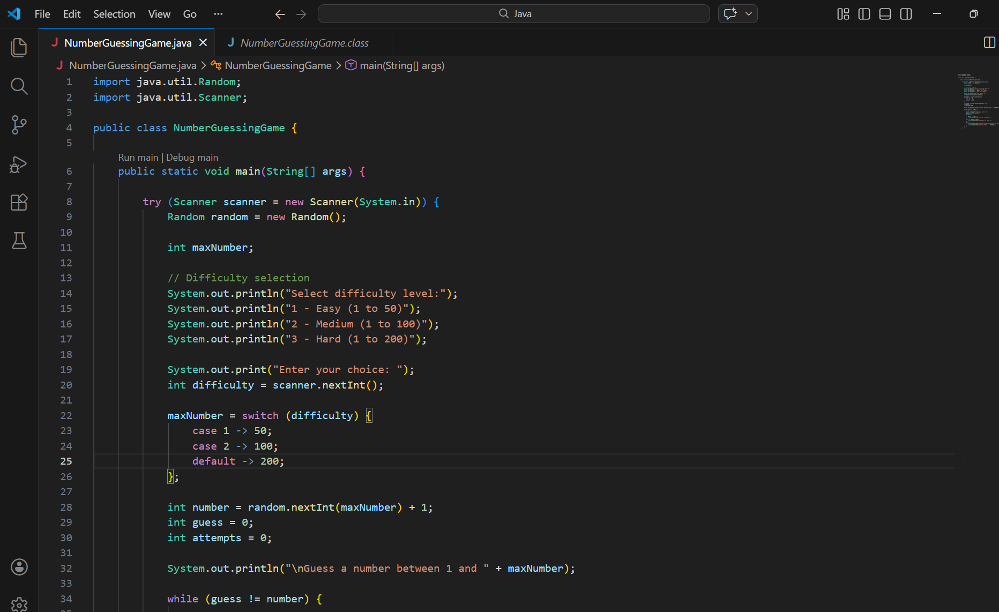

# Java Number Guessing Game

A console-based Java game where the player guesses a randomly generated number.

Features
- Random number generation
- Difficulty levels
- Attempt counter
- User input handling

Technologies
Java

